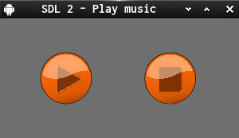

SDL2_simple_music_player:

Plays mp3-music

Left mouse button on button / or space switches play and pause.

Left mouse button on hold button or
backspace stops music (rewind to start).

  

Help on [Question](https://discourse.libsdl.org/t/how-to-load-audio-and-make-a-button/24223/1)
on [SDL-Discourse](https://discourse.libsdl.org).

Asset Info:
Music Title is "Wish You Were Here"
from THE.MADPIX.PROJECT

[Link](https://licensing.jamendo.com/de/track/1214935/wish-you-were-here)
