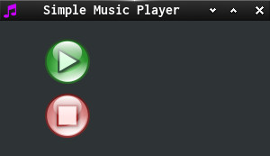

SDL2_simple_music_player:    
Help on [Question](https://discourse.libsdl.org/t/how-to-load-audio-and-make-a-button/24223/1) on [SDL-Discourse](https://discourse.libsdl.org).  
Plays mp3-music  

Left mouse button on button / or space switches play and pause.

Left mouse button on hold button or
backspace stops music (rewind to start).

  

The second program integrates the [slider example](https://github.com/Acry/SDL2-Slider) so we can control the volume with the pointer device.

  

[More example Code](https://gist.github.com/Acry/baa861b8e370c6eddbb18519c487d9d8)  

Asset Info:  
Music Title is "Wish You Were Here"  
from THE.MADPIX.PROJECT  
[Link](https://licensing.jamendo.com/de/track/1214935/wish-you-were-here)  
[Buttons](https://openclipart.org/detail/11572/audio-button-set)
[Button](https://openclipart.org/detail/184819/black-slider)  
[NimbusSanL-Regular](https://fontlibrary.org/en/font/nimbus-sans-l)  

[Get in touch on SDL-Discourse](https://discourse.libsdl.org/u/Acry/summary)